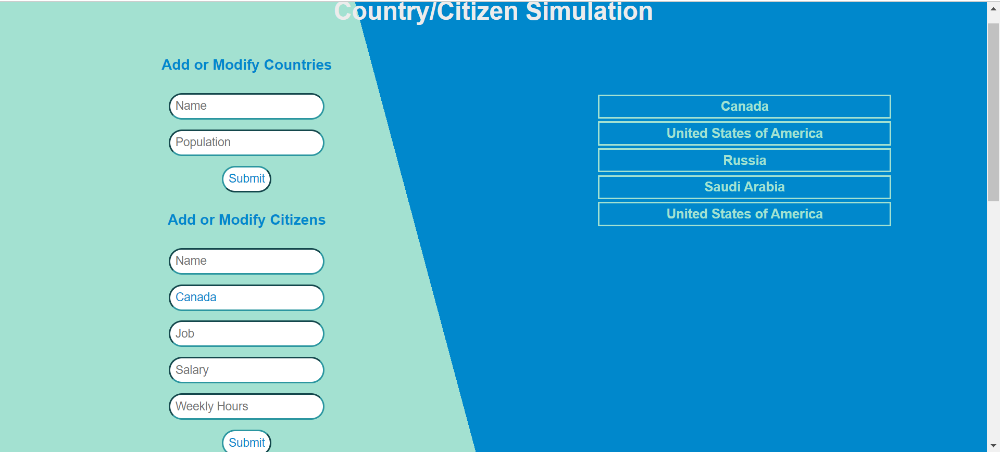

# Country/Citizen Simulation

Link to front-end repository: https://github.com/DRMADNESS2004/final_project_frontend.git  
Link to back-end repository: https://github.com/DRMADNESS2004/Final_Project_BackEnd_JWP.git

### What my application does:
My application allows users to add countries and citizens to a list. It also allows them to interact with a map to add countries or citizens more easily. Furthermore, the users can delete the countries and the citizens by clicking on them. They can also modify countries by changing their population through the form in a similar way they are added. 

My project was built using React js for the front-end and REST API with Spring Boot and JPA for the backend. I also used the librairies react-hook-form to implement forms easier and react-simple-maps to display a world map SVG with the countries defined. I used Intellij IDEA Ultimate to code my back-end and Visual Studio Code to code my front-end. 

### How to run the project:

To run the project, the backend needs to be run first. The backend is going to add the world's countries' names and population into the possible_countries table in the h2 database. Then, the front-end can be run.  

### Challenges I faced and features I hope to implement in the future:

One of the challenges I faced during the process of making my project was crashing my project. The crash was caused by node modules I had downloaded that were using a webpack in a version lower than 5 which didn't provide polyfills for these modules anymore. To fix it, I copied and pasted the necessary components into another repository and continued from there. 

Another challenge I faced was rendering the citizens inside the countries when they were added. Initially, whenever I added a citizen into a specific country, the country wouldn't display the citizen I just added. However, I figured out that I could render my citizens state not just when countries are displayed but also when the citizens state is modified.

One of the features I hope to implement in the future is being able to drag and drop the countries within a certain area to make the website more interactive and the citizens into another country. 

Another feature I hope to implement is displaying more information about countries other than their population.

### Design:

In my front-end, I have a WorldList component that contains my methods to load, add, modify, select, and delete countries. I also have a method that gets all the possible countries in the world and their population. Another one of my method is to get the current country id based on its name. I also have methods to add and modify citizens. The handleCountrySubmit and handleCitizenSubmit methods are used to handle my form submissions. My handleClick methods makes sure that the name of the country that was clicked and its population appear in the correct input field. In my country component, I have methods to load, select and delete citizens.

### Database Design: 

### Screenshots of the Web Application frontend:

